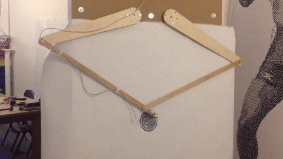
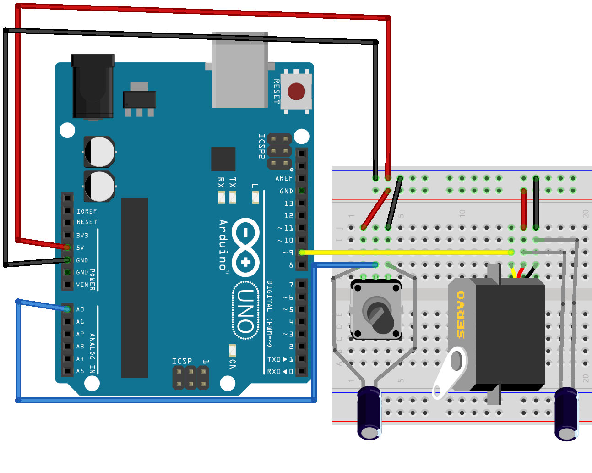

# Arduino2DPenPlotter
This project is to create a 2D plotter with a ink pen.



Like the video: [https://www.youtube.com/watch?v=Wb5XR8IF5E0](https://www.youtube.com/watch?v=Wb5XR8IF5E0).

# Dev-Tools

## Draw Circuit

* [Fritzing](https://fritzing.org/download/)
```
sudo apt install fritzing
```

## Develop

* [Arduino IDE](https://www.arduino.cc/en/Main/Software)

# Projects

## Test servo
Path: ArduinoCode/TestServoMotor
Subpath:
* CODE: test_servo_mtor/test_servo_mtor.ino
* SCHEMA: schema.ffz

HW Schema:


